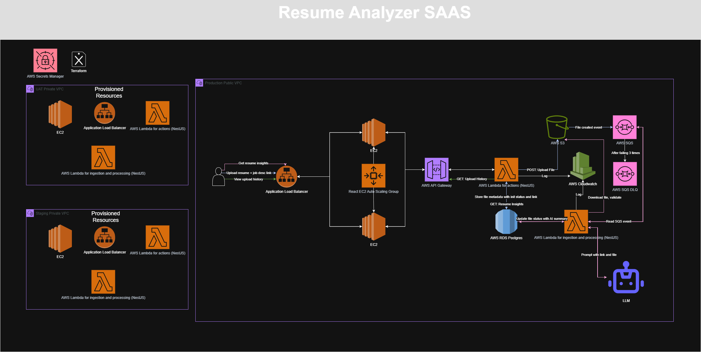
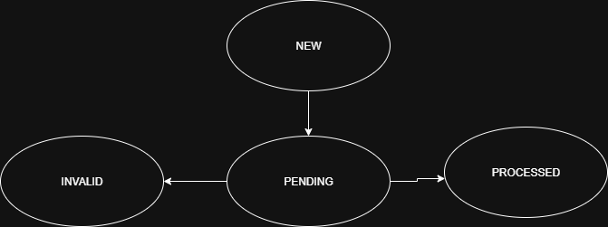

# Resume Analyzer – AI-Powered Resume Analyzer Which Provides Insights

  
📎 [Open full diagram in Draw.io](https://viewer.diagrams.net/?tags=%7B%7D&lightbox=1&highlight=0000ff&edit=_blank&layers=1&nav=1&title=resume-analyzer.drawio&dark=auto#R%3Cmxfile%3E%3Cdiagram%20name%3D%22Resume%20Analyzer%20Architecture%22%20id%3D%22nJEoycygDbeY5AVV3BBZ%22%3E7V1td9q4Ev41OefeD3Asv%2FORQGi7J92lSbfd3i85ChbErcGsLUiyv%2F5KtmWsF8AEG5sNaU6DhS3LmnlmRjOj8ZUxmL98iODy6XPooeBK17yXK2N4pet6DwDyh7a8Zi2Ga6Uts8j30jawabj3%2F0FZo5a1rnwPxdyJOAwD7C%2F5xkm4WKAJ5tpgFIXP%2FGnTMODvuoQzJDXcT2Agt373PfyUtrq6s2n%2FiPzZE7szsHvpN3PITs6eJH6CXvhcaDJuroxBFIY4%2FTR%2FGaCAzh6bl%2FS60ZZv84FFaIHLXPBh%2FfGP719%2BDmerMfrbWJrR48dfHaC5aT9rGKyyR86Gi1%2FZHEThauEh2o12ZVw%2FP%2FkY3S%2FhhH77TMhO2p7wPCBHgHyUh5WNdI0ijF4KTdkwP6BwjnD0Sk7Jvu3oTjZnGdeQYWYNzxsa6AbjkaciATQja4UZ5Wd5%2F5vJIR%2By%2BTlgrnRLmqo%2F%2B19Jwzjy1xAj8unbeCDN3jL0FzgZi3VNfsnoBtqVRb4Z0KMu7ZVrEI8dvgHIR7QPvkE8dvgGIHYPhPsDcYCFBumI614T7q8VBkh%2BjetwhQN%2FgQY5XilPzSLo%2BYRhBmEQRqRtES4Qz1YqrpuGC5xJDKCz42ziaa9EJmBI7hVlfSSUQNHNGqUESc8JAriM%2Fcf8qghNVlHsr9EditPOaStB75J%2Bnr%2FMqKTrwufY7M4IMpbJ8D%2BReym%2FfVgvJ3RsMY7CX4g93xWRgwNzNBrRUftBIDw3hYpPZFA%2F8Ge0WxzSu8DsKEBTTHskk%2BEvZrfJ0dDQsgko3KLfv3auXdLuwfgpx28VAAWuyQHUkuFpGaaMTqM2cPZ6EjhvBrIoU3IfNz1s7m%2FhIwrGYexjPyHtY4hxON9LnAmiLMbzroJ3jC5K2KJIfEKxkeXSedsKCJl2uyVVaYo6e%2Bnp2F1LJmjPqImeucQvELS%2FXAZk5hOC6NptCD3yh8w8XEzIlLeX1HAz7oeAjPrhkY1ZzQB2Awyg6wIH2BIHMMumSH9Hr43%2BQKb%2F93tKdzh%2F9GBiy0X0zhM6rzH59J%2FfUYx%2Fu%2F%2BvxAnxL4QnTxnRlepYqZJValmpmmX1zJ2WKEzFHcRGVZsjNwL5NKZj5UZVm8qgEK8GiquBcPV2dS7oIfJvREkvMvvN0KEwVyjHafJzArzuMyFgvEwfa%2Bq%2F0HGo7YAIxeEqmqDUCiAWRKyyB4KUcWsEsdETQGzIYtxVgNitDcR6ORATO4ZgN5XrcEHF%2BjIKJyiOyRcXZF%2BQ%2Fe6RrQOLQ7auWBCfFtpAts%2FGUbj2Y0I5RBF8l01dLKGWPDPmiSURUqT33Pc8erlyHcj7J4qEd09JEyCTBABHsQiqaw1k9KSpRt4MMa4PI%2FwUzsIFDG42rcLkbc65DSnEEur8RBi%2FZlMKVzgUgMZD39Zgjzy1Avr60LG1nSvQlGF2ESmzSjGMZmgnNTO%2Bp8%2B%2Fk5YRCohhvua9fSrKJJf2owi%2BFk7IVM6m5zFt2LCI5fKOLDI7RSofej75kI5gwyP5o7ydbSxHQvI3Hz2TltUySBdZT36Mw4xDRfZKZPZb4RxRHwvcOF94HT4sD1%2FG%2BxJ8c9dwdperovdV6dzQuprD%2FBuHsceGnuyUcDqNCaOKyK6AarbZBNjRi4%2F%2FopdTayE9%2FJEc6uxw%2BJL1nhy8Fg7GKPLJUyfuOE0WHJpmaWiqEhyaBobXg0oER8XyQAKwbQoANgVhn0qu7KoNVxwqWExbfZ9aBYWtcIAzCUGAvJpTF%2FiVTsik%2FQwfyf8eiifkDzEjf7VYdDAkVSI6gG25vFVwnCBh47H5K%2BqTKwwpXEDIDqjB5vlr8nGGk6lNm8gtuFZxfZbZ1HCCKZj3xY4k4m8FfHkrzTQEpLAAV8FMYyAtWml2bVZaI4L7CNHplLW5elXL2OPm2fqXzjNj6JbMsy6bj3eIAJ40JREYrU8nSddoUD1153xIwmYXX87Fl9NCXw6F9EOc8qpejQrqMZXDVJDCU3BS540uJ31cYmtVUFoy%2F0HDYTSmk99bWPwNGDW6gjvPVqD0tEFwQ%2FaxXqhXjnqm0zj1LJlSrTZADbekAWq1ywA1FNosCTL2x5%2BotQkxeoay7%2FJib7bT3swT496Jvbn0H2YZi1YiCwEQPB56r2Fz0wQS%2BE7hql6Qsf%2BVXZ8cpJ5qix1uPNXJ0WvxSPRVv12q6mWlasvcJ2Yj2uvciNYyX4xpvGei9coSrfLg8HFEayaS1w6iMQCdHdEa8S7nRAPNEu1cdZp9Idr56TT3HROttE6rPuHpOKI1korWEqKV1mktI5rViCFyyjQgqyxlWOZ8WygjJ2WM%2F7j%2FemX0SWOegzPyCUVUFGxHno1VZZ6NmW%2B0rjTPxlL1WX%2FSjdWIjjtl5m71PuMtiVJ5GraQQlt1Bh7QbaC80bbcXsXIgMBLdST3ygHADzei4PjY%2BvReBpDjZYfW1TSbo0PnSNFRv3hwGllstlIxs43KLVHMvTNLMis9z73KDaC3SVlLKAViWHuk7J4L6pGyPdk%2Buw1nLZanjG%2Br2S6hMXO5GlvsBPaWorjAZXP5vyqM%2FM7SFndsQT08gmzYLYsgW81GkJt1J5XW2S0LkdiNEO2kVqtRkjJ2u1zqti6pv9R3pE0iBHGyfRvRKlkttmDsbWLtTbu2dKP1Gz4Zs0k2y70c9OeMkoO06JYcTQFVTr8PgC2hKju5dXpVLPy2JX%2FV7D6uJr8Q3iUTDtCilpCHBVRVtRQJqbVpUXub1Xv%2F5f5i156LXeuQJe71u7Fr47%2FjiuDoWCXgeEqj1m1DuM1zNc0xVOzUtzTN3Gm51u7LtwVfTp7Uz%2FpIOUjy5Su8Qj1hRSMWYakqKuDo6iFvHZl4ARtZrf4qVoS5oAmG4fMiCwdME1twkH7ve0lp29bagW6VUUVLN%2FigTkdvu1nYO7Pt5HbZEj7Ve6CP8%2FTL25xb7uKtEhiay%2FLBmZhqOy4AOK%2B02qywDiuyk17lHF1V5xj9Xh2WAWgXmAFQJNRE4XyJE3uQmIOsak1WjnLa7tSanNkriY%2Fz4fHWO0ZsmZaXIqPvYSV8ifC83TclrIdMG7C90U0th1k%2Bn9o7pQ1vv1yQeS7IvPio3gZLhwU6WfKKZjYLSuZwacqI3tjNPziz%2BSSBV%2BYv3x%2Fea9c2J4cxXkGSTumEEEsI%2BlkRLoM%2BGJkouTxze8xaxn1VWLXAMfgVbOuTlFhRoMawB0wefcWGQxBYKBrr8OtbYOqtXuCeqmysKSYtAp3voqyj23aSdDyN%2FQjqBNhd09Q2PxZ%2Fl6qK04pPY4Cdg5affrfPXAwLCOfX4zJ35PD7B4r7TeVbfxFTjdxqgapXJ1A1E%2FA7cIzWC9RGtv9WmJDUQGWmLVEro8fT3hR32WwRWAfH06Qbmbtlw74LahIOcnDgHocRyj2HGrkD9CCGG%2F%2Biv%2FBxwowQr%2BLcJZV6HW04pwucxWO8zPmhnQKF%2Bd6qCTI4rbXQls%2Fgy%2BvdD%2Ff3Wdz%2FH%2FrtAfqPcUehEtjeqjumFT41rhVK06Y0vXcR0c5fKdsKuu3cRCS5mu6G9P9xGONZpFgZtafQYuTFsmrRbxwjed9nfYUWgWHzWz1MVZXMzMooeijcuha7rOMzTg1vZciuZSnLbrOL4bMjc2nXVT0r3IPtPFfMznN7u%2B088QJLO8FualfW%2BHcoyZlKgxRtT5pnKKpi%2FUcUPW%2BunUGu1LYU%2BkEQrrxnSINJ7dX5k80g5YR8qzdIIjE1qn5bqF%2BgK0osu%2FpJSyz35NK%2F4yj0VpMszD9ePQY%2BfQXRt%2FFAoqwyYCgFC8VAoRQk5AOEUvBNDLxJQTc%2B%2FCdFCMUwohRr5MORUkRQDBtKscWdAb8t7FRgVdUrffYF34iswZDcK8r6EPdnpOcEAVzG%2FkbqRWiyimIiWO6oOGStyrjdLHnDCB2%2BKl6XfPuwXibFyiXtm9cfLkIse%2B7dSA7QlO4diclk%2BIvZbXI0NBRx037%2F2kkMdU6OVIBRQ3iPuyEjFFhszc6Z55pWE0SdZiuBHZqGV5fhtlN81e6u04RaNaZDoM%2F3UjqVPn8X2fa%2BtsQRKrPC5ISvP5dpmjpzt%2BVetczZ1qeV4OPVfA5bXeaGgaUS%2F3z%2Bftq3ck9eH0eQDfUZaOz1p%2Be3JaZpfIuYFPrYgkgFujXBfV5yy83h5bOkG51g%2FZbnIRez%2BG8%2FS0zHjAp%2FDmeCvaM2AfauAQL6xTWc%2FJol7KpKiUpu1md5ScokpWw8wyeMl3HiaB6R34m3AF2fCIipT4AQdSfkjvoojTaMaDuhw2i1SD51qI3XWYdBhwiHEU3uHUUhGWUH6G53uZgdyNmHeA4tnkctRVEJoCuSm%2FLG6tPANZkd7jGcpRky48hfp0rlsnq4rB7eweqhA1x%2B%2BaBy7lusUgL3Svva3mkPNDlW8y7egbVHYJUmqrAiVG16Pu1rsQDLOrq8ffA0HJBv4WEs0PA7CYFWcsPOpfra%2Be4AuOzNqRjFRk9AsSEL8lPuDMijP5dtdxdoX6B9lIJmjjoWWNMURtopsc1W5vJWPDSJEHXraJ%2FhAs4UttkFte1E7XBomObg3aA2Thn1YZ6xaUXrY6Euakf1kuGTAlWXgPoVRREkmne%2BG5p76cudLZFmr0NUWRhQSoWnPyquUXJ6mSp%2BEx9H%2Foue%2FX3AbDIeiM2x9r3KOMEQ3zfdUbhKTKvLdo0UuYEtwWswyeQt1Hkecn8Bg9d%2Fkk2A9%2F2%2BXO%2BPPDmuL%2F5Fgy6Z2w2U4Q7WtBEZli2IDFABHW0hiayjipjbrI0PmNdFRCDv3hxT5o0JQJPKrHeZBJTzk4%2BhocoTy0fWivLbrQZHW4qlcSEB4MizX5%2B7kd2tHXmmTusTTfOI2tlkmjoaz3R25vTeXqFPuMDSj9pRlETcQlw8naquz6FHExBu%2Fg8%3D%3C%2Fdiagram%3E%3C%2Fmxfile%3E)

---

## Overview

Resume Analyzer is a platform that helps users optimize their resumes based on job descriptions. By uploading a resume and providing a job link, users receive keyword suggestions and feedback from an AI-powered system.

This project follows a scalable, serverless-first architecture with proper staging, uat and production environments.

The main goal of creating this project is to expose myself to new technologies that are commonly used in the industry and hone my solution architecture skills. It may look like overengineering but it helps me learn in the process and prepare for more complex cloud architectures.

---

## User Flow For Upload Resume + Job Description Link (POST /upload)

1. **User uploads a resume** (`PDF`) and provides a **job description link** through the frontend.
2. **Frontend** interacts with the lambda meant for API endpoints via the API Gateway to validate and upload the file to S3.
3. **Lambda** updates the file status and job link and file metadata in RDS Postgres.
4. **S3** triggers a file created event to be sent as a message to SQS when file is being uploaded.
5. **Cloudwatch** handles logs for the API request.

---

## User Flow For Get Resume Insights (GET /resume-analysis/:id)

1. **Frontend** polls to return an insight summary if available via useEffect whenever a user uploads a file.
2. **Lambda** meant for ingestion reads from the SQS queue in the background, downloads and validates the S3 file via a set of rulesets from the chain of responsibility design pattern
3. **Lambda** calls the AI to generate resume insights and transitions the RDS file status to PROCESSED. If any errors occur in between, state will be transitioned to INVALID. Note that state machine will account for retrying for transient errors like database downtime via SQS. If message fails 3 times, it gets sent to a SQS dead letter queue for further analysis later on.
4. **Lambda** meant for API endpoints successfully polls and fetches the completed insights from RDS to return to the user.
5. **Cloudwatch** handles logs for the API request.

---

## User Flow For Viewing Of Upload History (GET /upload-history)

1. **Frontend** polls to return an insight summary if available via useEffect whenever a user uploads a file.
2. **Lambda** meant for ingestion reads from the SQS queue in the background, downloads and validates the S3 file, calls the AI to generate resume insights and updates the RDS database.
3. **Lambda** meant for API endpoints successfully fetches the completed insights from RDS.
4. **Cloudwatch** handles logs for the API request.

---

## State Machine Flow For File Status

- A state machine might be overkill here but its to scale early to allow for more state transitions in the future. Init state will be NEW. When processing, intermediary state will be PENDING, if anything goes wrong server side (transient), will let sqs retry and will still be pending and user will know. INVALID state will be for non-transient failures. PROCESSED will be the success case.

---

## CICD Flow

# CI will run on every branch

1. Perform SAST with sonarcloud, OWASP Dependency Check
2. Once SAST pass, move on to build phase, checkout source code, install dependencies, lint and tests, build and package (if only in main), upload artifact (if only in main)

# CD will run only on main branch

1. Initialise Terraform with correct environment
2. Provision and update infrastructure and deploy
3. Perform DAST check with OWASP ZAP

---

## Environments

- **Staging** (Staging VPC + isolated resources)
- **UAT** (UAT VPC with realistic test data)
- **Production** (Deployed in Public VPC with minimum exposure)

---

## API Endpoints

All endpoints are managed through **API Gateway** → **Lambda** and secured using API keys / IAM roles.

| Method | Endpoint               | Description                       |
| ------ | ---------------------- | --------------------------------- |
| POST   | `/upload`              | Uploads resume metadata + job URL |
| GET    | `/upload-history`      | Fetches user's resume history     |
| GET    | `/resume-analysis/:id` | Returns OpenAI feedback           |

---

## Technologies Used

| Layer            | Stack                                                 |
| ---------------- | ----------------------------------------------------- |
| Frontend         | React (hosted on EC2 with Auto Scaling + ALB)         |
| Backend          | AWS Lambda (nestjs wrapper) + API Gateway             |
| File Storage     | Amazon S3                                             |
| Metadata Storage | Amazon RDS (PostgreSQL)                               |
| Async Processing | Amazon SQS (resume job queue)                         |
| Secrets Mgmt     | AWS Secrets Manager (for DB credentials and API keys) |
| CICD             | Github Actions                                        |
| Local testing    | Docker                                                |
| Monitoring       | AWS CloudWatch Logs                                   |
| Resume Analysis  | OpenAI GPT with Web Search Plugin                     |
| Infrastructure   | Provisioned using Terraform                           |
| Networking       | VPCs for Staging, UAT, and Production                 |

---

## Infrastructure Design Notes

- All environments are isolated in separate **VPCs**.
- **Secrets Manager** stores database and OpenAI credentials securely.
- **2 Lambdas** is used, one for API logic (resilient, low-latency design), and one for ingestion, file validation and processing. This is to provide decoupling between processes to provide for easier scalability in the future
- Auto Scaling policy is enabled for frontend EC2 instances in production.
- This design has not yet been fully optimised for cost and is more for me to practice integrating with such technologies.

---

## Future Improvements

- Add more tests, unit test, end to end test and integration tests
- Use Cloudfront for static web hosting if application scales out
- Integrate with other monitoring tools such as datadog.

---

## Thoughts and Reflections

- SQS might not be needed here but i wanted to practice integrating code with SQS.
- SQS will help if a lot of users use our application and we need a queue to handle those requests
- If processing takes too long, can notify the user instead of polling the request to retrieve the insights

---
